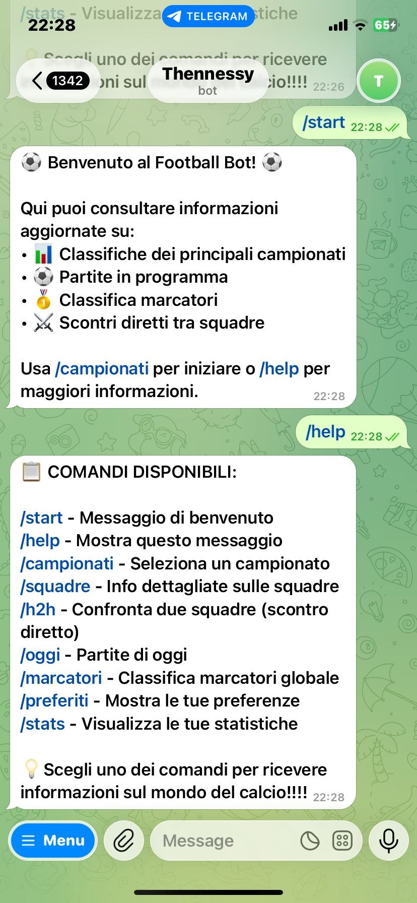
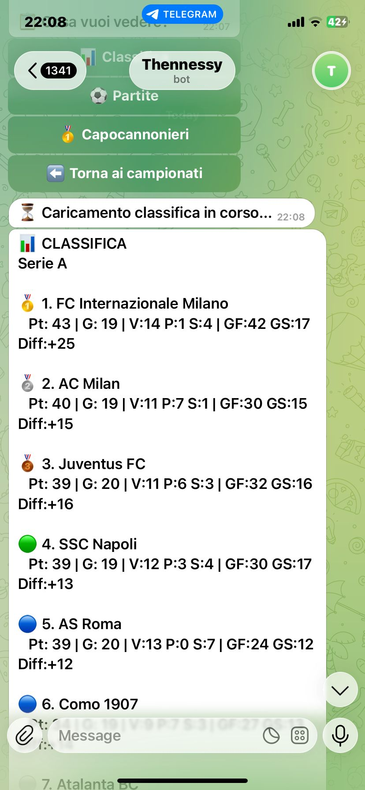

# Telegram Football Bot

Ho realizzato un bot di telegram in Java che fornisce informazioni aggiornate sui principali campionati di calcio europei utilizzando l'API di [football-data.org](https://www.football-data.org/).

## Descrizione del Progetto

Football Bot è un assistente interattivo che permette agli utenti di consultare in tempo reale:
- Classifiche dei campionati (Serie A, Premier League, La Liga, Bundesliga, Ligue 1, Champions League)
- Partite in programma e risultati in diretta
- Classifiche marcatori dettagliate
- Informazioni sulle squadre e rose complete
- Scontri diretti tra squadre
- Statistiche personali di utilizzo

Il bot utilizza un sistema di caching intelligente per ridurre le chiamate API e garantire risposte rapide, oltre a un database SQLite per memorizzare preferenze utente e lo storico ricerche.

## Tecnologie Utilizzate

- **Linguaggio**: Java 17
- **Build Tool**: Maven
- **Bot Library**: TelegramBots Java Library v7.2.1
- **Database**: SQLite v3.45.0.0
- **API Esterna**: [football-data.org API v4](https://www.football-data.org/documentation/api)
- **JSON Parsing**: Google Gson v2.10.1
- **Configurazione**: Apache Commons Configuration v2.9.0

## Schema Database

Il bot utilizza un database SQLite (`footballbot.db`) con le seguenti tabelle:

### Tabella "users"
Memorizza informazioni sugli utenti e le loro preferenze.
```sql
CREATE TABLE users (
    user_id INTEGER PRIMARY KEY,
    username TEXT,
    first_name TEXT,
    last_name TEXT,
    preferred_league TEXT,
    favorite_team TEXT,
    notifications_enabled INTEGER DEFAULT 0,
    created_at TEXT DEFAULT CURRENT_TIMESTAMP,
    last_activity TEXT DEFAULT CURRENT_TIMESTAMP
)
```

### Tabella "query_history"
Traccia tutte le ricerche effettuate dagli utenti.
```sql
CREATE TABLE query_history (
    id INTEGER PRIMARY KEY AUTOINCREMENT,
    user_id INTEGER,
    query_type TEXT,
    league_code TEXT,
    timestamp TEXT DEFAULT CURRENT_TIMESTAMP,
    FOREIGN KEY (user_id) REFERENCES users(user_id)
)
```

### Tabella "api_cache"
Sistema di caching per ottimizzare le chiamate API.
```sql
CREATE TABLE api_cache (
    id INTEGER PRIMARY KEY AUTOINCREMENT,
    cache_key TEXT UNIQUE,
    cache_data TEXT,
    league_code TEXT,
    created_at TEXT DEFAULT CURRENT_TIMESTAMP,
    expires_at TEXT
)
```

### Tabella "favorite_teams"
Gestisce le squadre preferite degli utenti.
```sql
CREATE TABLE favorite_teams (
    id INTEGER PRIMARY KEY AUTOINCREMENT,
    user_id INTEGER,
    team_name TEXT,
    team_id INTEGER,
    added_at TEXT DEFAULT CURRENT_TIMESTAMP,
    FOREIGN KEY (user_id) REFERENCES users(user_id),
    UNIQUE(user_id, team_id)
)
```

## Setup e Installazione

### Prerequisiti
- Java JDK 21 o superiore
- Maven 3.6
- Account Telegram
- API Key di football-data.org (gratuita)

### 1. Ottenere il Bot Token di Telegram

1. Apri Telegram e cerca [@BotFather](https://t.me/botfather)
2. Invia il comando `/newbot`
3. Segui le istruzioni per creare il bot
4. Salva il **token** che ti viene fornito

### 2. Ottenere l'API Key di football-data.org

1. Registrati su [football-data.org](https://www.football-data.org/client/register)
2. Verifica la tua email
3. Accedi e vai su [API Token](https://www.football-data.org/client/tokens)
4. Copia la tua **API Key**

### 3. Configurazione del Progetto

**IMPORTANTE**: Non bisogna mai committare il file "config.properties" su GitHub! È già incluso nel ".gitignore".

## Comandi Disponibili

| Comando | Descrizione |
|---------|-------------|
| `/start` | Messaggio di benvenuto con introduzione al bot |
| `/help` | Lista completa dei comandi disponibili |
| `/campionati` | Seleziona un campionato (Serie A, Premier, Liga, Bundesliga, Ligue 1, Champions) |
| `/squadre` | Visualizza informazioni dettagliate sulle principali squadre europee |
| `/h2h` | Confronta due squadre e visualizza l'ultimo scontro diretto |
| `/oggi` | Partite di oggi da tutti i campionati |
| `/marcatori` | Classifica marcatori globale di tutti i campionati |
| `/preferiti` | Visualizza le tue preferenze (campionato e squadra preferita) |
| `/stats` | Statistiche personali di utilizzo del bot |

## Esempi di Utilizzo

### Esempio 1: Consultare la classifica della Serie A
```
User: /campionati
Bot: [Mostra menu con i campionati]
User: [Seleziona 🇮🇹 Serie A]
Bot: [Mostra opzioni: Classifica, Partite, Capocannonieri]
User: [Seleziona 📊 Classifica]
Bot: [Mostra classifica aggiornata della Serie A]
```

### Esempio 2: Vedere l'ultimo scontro diretto
```
User: /h2h
Bot: Seleziona la PRIMA squadra
User: [Seleziona Inter]
Bot: Seleziona la SECONDA squadra
User: [Seleziona Milan]
Bot: [Mostra risultato dell'ultimo Derby della Madonnina]
```

### Esempio 3: Informazioni su una squadra
```
User: /squadre
Bot: [Mostra lista squadre]
User: [Seleziona Manchester City]
Bot: [Mostra info squadra: nome, stadio, colori, composizione rosa]
```

### Menu Principale

### Classifica Serie A
## 
## 

## Funzionalità Implementate

### Sistema di Caching Intelligente
- **Classifiche**: Cache di 30 minuti
- **Partite**: Cache di 10 minuti
- **Marcatori**: Cache di 60 minuti
- **Info Squadre**: Cache di 120 minuti
- **Partite di oggi**: Cache di 5 minuti (per risultati in tempo reale)

### Statistiche Utente
Il bot traccia:
- Campionato più consultato
- Storico delle ultime 5 ricerche
- Preferenze personali (campionato e squadra preferita)
- Timestamp di ogni attività

### Gestione Errori
- Validazione automatica delle API key
- Messaggi di errore user-friendly
- Fallback su dati in cache in caso di errore API
- Logging completo per debugging

## Sicurezza

- API keys memorizzate in file di configurazione esterno
- File sensibili esclusi da Git tramite `.gitignore`
- Template di configurazione fornito (`config.properties.example`)
- Nessuna credenziale hardcoded nel codice

## Statistiche API

L'API gratuita di football-data.org ha i seguenti limiti:
- **10 richieste al minuto**
- **Competizioni limitate** (no coppe nazionali nella versione free)
- **Dati aggiornati ogni 60 secondi**

Il sistema di caching del bot è ottimizzato per rispettare questi limiti.

## Struttura del Progetto

```
telegram-football-bot/
├── src/
│   └── main/
│       ├── java/com/footballbot/
│       │   ├── Main.java                 #Entry point
│       │   ├── FootballBot.java          #Logica bot e gestione comandi
│       │   ├── FootballAPI.java          #Client API football-data
│       │   ├── DatabaseManager.java      #Gestione database SQLite
│       │   └── MyConfiguration.java      #Caricamento configurazione
│       └── resources/
│           ├── config.properties.example #Template configurazione
│           └── config.properties         #Configurazione reale (gitignored)
├── pom.xml                               #Configurazione Maven
├── .gitignore                            #File esclusi da Git
└── README.md                             #Documentazione
```

## Risoluzione problemi(Troubleshooting)

### Il bot non risponde
1. Verificare che il `BOT_TOKEN` sia corretto
2. Controllare che il bot sia stato avviato correttamente
3. Verificare la connessione internet

### Errore API "Unauthorized"
- Verifica che la "FOOTBALL_API_KEY" sia corretta e attiva
- Controlla su football-data.org se l'account è verificato

### Database non trovato
Il database viene creato automaticamente all'avvio. Se manca, verrà generato nella directory di esecuzione.

### Troppi errori "Rate Limit"
La versione gratuita dell'API ha limiti. 

## Possibili Miglioramenti

- Aggiungere notifiche push per gol in tempo reale
- Implementare un sistema multi-lingua
- Calendario partite personalizzato per squadra preferita
- Confronto statistico tra più giocatori
- Export dati in formato PDF/CSV
